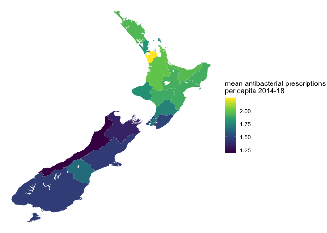
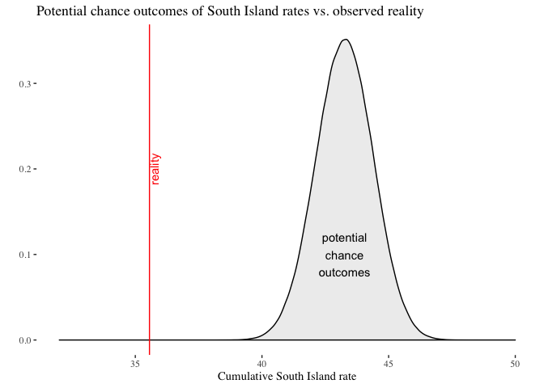
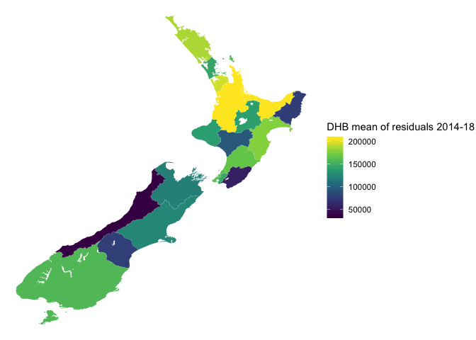
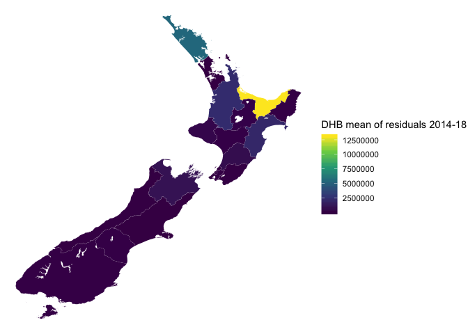
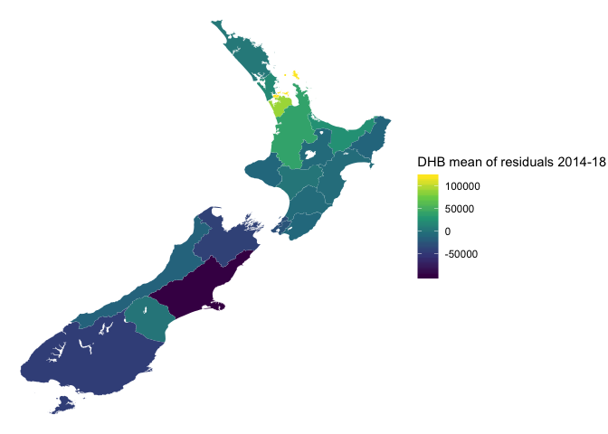
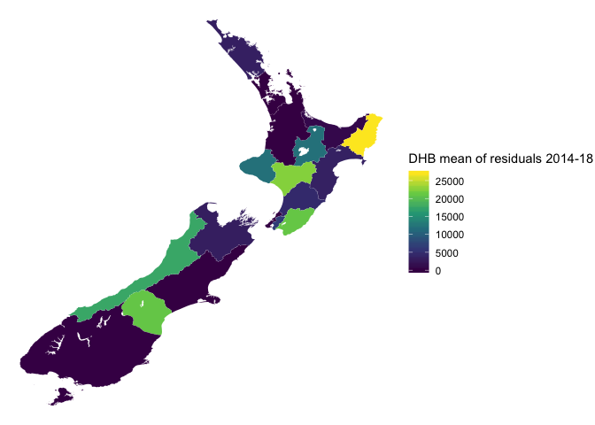

*Note*: the easy read version with the graphs is README.md, to see the R analysis code that made the easy read version consult README.Rmd

In 2018 the Ministry of Health made available aggregate data about the number of prescriptions by District Health Board and year at https://minhealthnz.shinyapps.io/datapharm/ (Data tab then download full data set).

I decided to make a map of Antibacterial prescriptions by District Health Board area. Which also requires the digital map boundaries - https://koordinates.com/layer/4324-nz-district-health-boards-2012/ - from Koordinates, and population information - http://nzdotstat.stats.govt.nz/wbos/Index.aspx?DataSetCode=TABLECODE7509# - from Statistics New Zealand, NZ.Stat.

<!-- -->

Northerly DHBs are prescribing antibacterials at nearly twice the per capita rate as the west coast of the South Island, and there is a general south-north gradient of prescription rates. This is very unexpected.

To measure the unexpectedness of it, I ran a perturbation test between the North and South Island. The logic works like this:

* We have 100 rate observations, 5 years for 20 DHBs. 25 are for the South Island, 75 are for the North Island.
* If we add together the rates, we get a number representing a year-areas for each (and if we subtract the South Island from the North, we get an expression of how different they are)
* If the variation was random, any observation was equally likely to occur in any time/place.
* We can repeatedly randomly assign the values to a time/place, and see how often the differences between islands are as great (or greater) than reality.

This idea is broadly similar to the infer package for R and the idea "there is only one test" http://allendowney.blogspot.co.nz/2016/06/there-is-still-only-one-test.html 

In this case, we are testing the unlikeliness of the arrangement (and the consistency of that arrangement in time). We can simplify the problem even more by observing:

* As we are randomly assigning from a fixed pool of possible outcomes, in order for the the difference between the islands to be equal to or greater than reality, the total for the South Island needs to be equal to or lower than the real total for the South Island (as the non-Southern values are going to be assigned to the North Island and the overall total is always the same), so we only need to make the 25 draws for the South Island.

Step 1, work out the aggregate "total of rates" 


```
## # A tibble: 2 x 2
##   Island totrat
##   <chr>   <dbl>
## 1 N       146. 
## 2 S        35.6
```

We now make 1 million random draws of 25 of the rates (representing hypothetical South Islands) and calculate the sum of each draw. Then we see in how many cases the sum of the random draw was as low (or lower) than reality. Making 25 million random draws takes a few moments.


```
## [1] 0
```

```
## [1] 37.65538
```

When I ran the code, there was zero of the million times a random arrangement was as low or lower than the true South Island. The lowest value at random was 37.655378 which is well above 35.55915. So we can conclude that the geographic arrangement, and its consistency over time, is not random.

<!-- -->

So it is a thing. But what thing?

Temperature gradient? No, not that pattern. I checked.

Population density? No, not that pattern. I checked.

Income? No, not that pattern. I checked.

Age demographics? Well...

If I create a baseline model based on total population (per capita) for the number of antibacterial prescriptions, then I have something to compare other models too.


```
## 
## Call:
## glm(formula = prescriptions ~ Total_people_age + 0, family = "poisson", 
##     data = model_data)
## 
## Deviance Residuals: 
##    Min      1Q  Median      3Q     Max  
##  -2064    1583    2587    3260    5275  
## 
## Coefficients:
##                   Estimate Std. Error z value Pr(>|z|)    
## Total_people_age 3.385e-06  3.163e-11  107016   <2e-16 ***
## ---
## Signif. codes:  0 '***' 0.001 '**' 0.01 '*' 0.05 '.' 0.1 ' ' 1
## 
## (Dispersion parameter for poisson family taken to be 1)
## 
##     Null deviance: 2252859451  on 105  degrees of freedom
## Residual deviance:  918908604  on 104  degrees of freedom
## AIC: 918910134
## 
## Number of Fisher Scoring iterations: 6
```

The model essentially says that population is a fantastic indicator. The number of people and the number of prescriptions closely track. However, the issue is not that the model does no predict correctly in general, it is that there is a geographically structure not captured by the model. In this case the residuals of the model are the bits not explained if you apply the same population model to the entire country, so if the "per capita" geographic spread is a real thing, we would expect it to show up in the residuals.

<!-- -->

So the residuals Poisson (count) model predicting annual prescriptions on the basis of  population has shifted the geographic clustering a little, but still with the same North/South pattern. Some shifts are expected as the model attempts to minimise error, rather than adopt a direct per capita rate.

With a base model to compared things to, I can make a model with a distinction between children, working age, and retired people 


```
## 
## Call:
## glm(formula = prescriptions ~ X0_14_years + working_age + X65_years_and_over + 
##     0, family = "poisson", data = model_data)
## 
## Deviance Residuals: 
##    Min      1Q  Median      3Q     Max  
##  -2130    1504    2340    3219    4876  
## 
## Coefficients:
##                      Estimate Std. Error z value Pr(>|z|)    
## X0_14_years        -1.613e-04  1.061e-08  -15208   <2e-16 ***
## working_age         1.035e-04  4.750e-09   21788   <2e-16 ***
## X65_years_and_over -2.188e-04  1.159e-08  -18880   <2e-16 ***
## ---
## Signif. codes:  0 '***' 0.001 '**' 0.01 '*' 0.05 '.' 0.1 ' ' 1
## 
## (Dispersion parameter for poisson family taken to be 1)
## 
##     Null deviance: 2252859451  on 105  degrees of freedom
## Residual deviance:  821444288  on 102  degrees of freedom
## AIC: 821445823
## 
## Number of Fisher Scoring iterations: 11
```

The models optimal formula has all three groups playing an important role.

But the actual issue is the geographic distribution of residuals.

<!-- -->

It is still a geographic distribution, just with more extreme values between the North and South Islands.

However, to some extent, the model is overfitting due to a faulty premise. Because the model wanted to find the best match to reality it could, with three different age bands it used the count some of the ages groups to reduce the number of prescriptions, and while this mathematically fits well it is nonsensical to say that as the number of children or retirees increase in population then the number of prescriptions decrease.

To deal with this we can run a Nonlinear Least squares model to force the components to be positive


```
## 
## Formula: prescriptions ~ b.1 * X0_14_years + b.2 * working_age + b.3 * 
##     X65_years_and_over
## 
## Parameters:
##     Estimate Std. Error t value Pr(>|t|)    
## b.1   8.9678     1.0046   8.926 1.92e-14 ***
## b.2   0.0000     0.3098   0.000        1    
## b.3   0.0000     0.8705   0.000        1    
## ---
## Signif. codes:  0 '***' 0.001 '**' 0.01 '*' 0.05 '.' 0.1 ' ' 1
## 
## Residual standard error: 88210 on 102 degrees of freedom
## 
## Algorithm "port", convergence message: both X-convergence and relative convergence (5)
```

In this model, the number of children seems to be the only thing the model needs.

<!-- -->

With this Nonlinear model, there is still a North/South pattern.

And, in considering the various model variations there is no real gain in dividing the population into age bands- the models perform about as well, and they all show the same geographic structure. With the principle of Parsimony - choosing the simplest alternative, then Total population is the preferred model.

However, there is another group of relevant people. Rather than thinking about prescriptions that accumulate among people in a per capita way, think about prescriptions as being something people go to the doctor for. So a prescript needs a doctor, who has a limited number of consultations in a working week. Full Time Equivalent (FTE) medical workforce figures are available from the Medical Council of New Zealand and the Royal New Zealand College of General Practitioners. I could not find any 2018 data available yet, so am repeating the 2017 regional figures for 2018 to add General Practitioners as a variable to the model.


```
## 
## Call:
## glm(formula = prescriptions ~ FTEGPS + Total_people_age + 0, 
##     family = "poisson", data = GP_data)
## 
## Deviance Residuals: 
##    Min      1Q  Median      3Q     Max  
##  -1171    1083    1690    1926    2362  
## 
## Coefficients:
##                   Estimate Std. Error z value Pr(>|z|)    
## FTEGPS           1.426e-02  3.081e-06    4627   <2e-16 ***
## Total_people_age 1.576e-05  2.199e-09    7167   <2e-16 ***
## ---
## Signif. codes:  0 '***' 0.001 '**' 0.01 '*' 0.05 '.' 0.1 ' ' 1
## 
## (Dispersion parameter for poisson family taken to be 1)
## 
##     Null deviance: 1015276703  on 100  degrees of freedom
## Residual deviance:  261609062  on  98  degrees of freedom
## AIC: 261610505
## 
## Number of Fisher Scoring iterations: 8
```

The Poisson model is solid for both number of GPS and the Total number of People, but then it was for the age groups as well. The AIC has seen a big drop verses the Total population model (at least compared to the drop seen with the age group one) which is a sign that the model is more accurate. The ultimate question is does the addition of GPs account for the geographic pattern, which is measured by checking what is happening among the residuals.

<!-- -->

That is a more random looking mix of residuals, which suggests than the number of GPs per DHB area contributes to the number of antibacterial prescriptions. To lock the numbers down, I  repeating the simulation gives an exact number on the North/South Island difference. First summing the residuals for the North and South Island to have a threshold to simulate against.


```
## # A tibble: 2 x 2
##   Island  totrat
##   <chr>    <dbl>
## 1 N      569062.
## 2 S      209612.
```

Then, as before, I generate a shuffled South Island from the data set a million times and see how likely a result that extreme is by chance


```
## [1] 0.652948
```

This amount of difference occurs randomly between the North and South Islands around 65.29 per cent of the time.

Since I have gone from noticing a structure which occurred by chance less than one in a million, to a pattern that chance would make 65% of the time, I think I have identified the variable providing the geographic structure. Doctors. In this case, the right way to think of prescriptions is as the result of an interaction between doctor and patient that takes place in a Doctor's practice, rather than as a per capita accumulation over time. 

If there is a moral to this beyond "build sensible models and check them", it is to give time to thinking about how the data (in this case prescriptions) is generated and if excluding parts of that process creates unexpected systematic biases.


